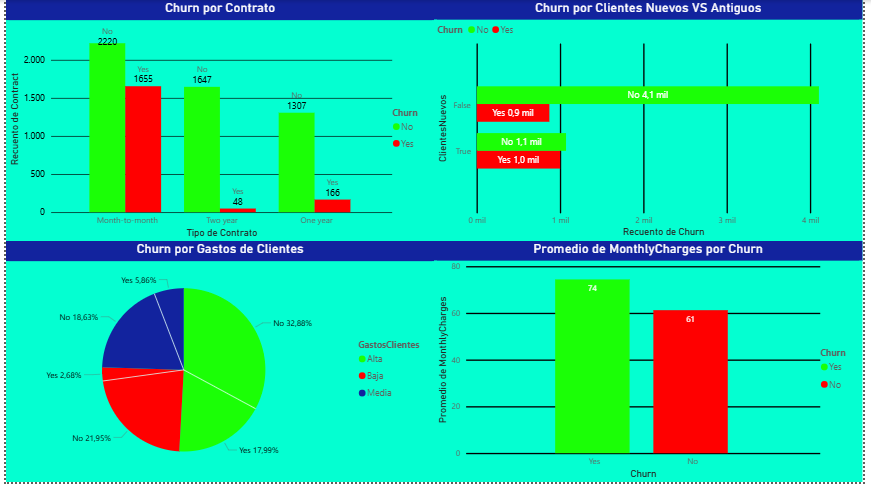

# 📊 Análisis de Churn - Telecom

## 📌 Descripción del Proyecto

Este proyecto tiene como objetivo analizar el abandono de clientes (Churn) en una empresa de telecomunicaciones.

Se trabajó con datos reales de clientes para identificar patrones y detectar las principales causas por las cuales los clientes cancelan el servicio.

El análisis fue realizado utilizando:

- Python (Pandas, limpieza y preparación de datos)
- Power BI (visualización y dashboard interactivo)

---

## 🎯 Objetivo del Análisis

Responder preguntas clave del negocio:

- ¿Los clientes nuevos se van más que los antiguos?
- ¿Influye el tipo de contrato en el abandono?
- ¿Los clientes que pagan más tienen mayor probabilidad de irse?
- ¿El servicio de internet afecta el churn?
- ¿La falta de seguridad online influye en la cancelación?

---

## 🧹 Preparación de Datos (Python)

Se realizaron los siguientes pasos:

- Limpieza de valores nulos
- Conversión de columnas a formato numérico
- Creación de nuevas variables como:
  - ClienteNuevo (tenure < 12 meses)
  - GrupoGasto (Bajo, Medio, Alto)
- Exportación del dataset limpio para Power BI

---

## 📊 Análisis en Power BI

Se construyó un dashboard interactivo para visualizar:

- Porcentaje de churn en clientes nuevos vs antiguos
- Churn por tipo de contrato
- Churn por nivel de gasto mensual
- Churn por tipo de servicio de internet
- Relación entre seguridad online y abandono

---

## 🔍 Hallazgos Clave

- Los clientes nuevos presentan una tasa de churn significativamente mayor.
- Los contratos mensuales (Month-to-month) tienen el mayor porcentaje de abandono.
- Los clientes con mayor gasto mensual muestran mayor probabilidad de churn.
- El servicio de fibra óptica concentra una mayor proporción de clientes que cancelan.
- La mayoría de los clientes que abandonaron no contaban con seguridad online.

---

## 💡 Conclusión Estratégica

El problema principal no es solo el precio, sino la combinación de:

- Clientes nuevos sin fidelización temprana
- Contratos flexibles sin compromiso
- Servicios premium con mayor fricción
- Falta de valor agregado como seguridad online

Se recomienda mejorar la experiencia durante el primer año del cliente y fortalecer estrategias de retención temprana.

---

## 🖼 Dashboard Power BI

---

## 🛠 Tecnologías Utilizadas

- Python
- Pandas
- Power BI
- Git & GitHub

---

## 📂 Estructura del Proyecto
> data:datoslimpios.xlsx
analysis.py
GraficoVisual.png
LICENSE
README.md
WA_Fn-UseC_-Telco-Customer-Churn.csv
