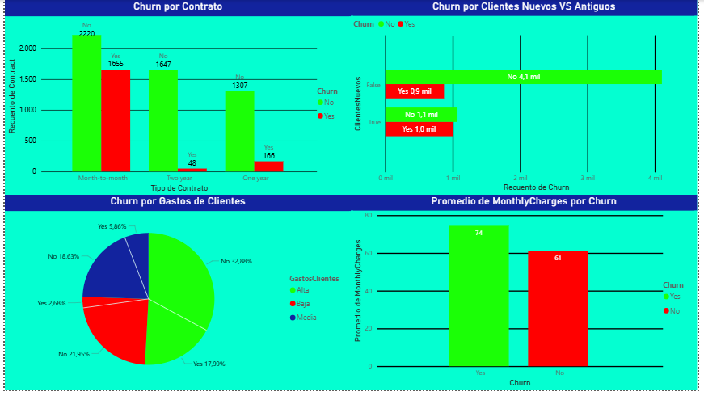

# 📊 Análisis de Churn en una Empresa de Telecomunicaciones


---

# 📖 Descripción

La pérdida de clientes (**Customer Churn**) representa uno de los principales desafíos para las empresas de telecomunicaciones, ya que afecta directamente los ingresos, la fidelización y el crecimiento del negocio.

Este proyecto desarrolla un análisis integral de datos para identificar los factores asociados al abandono de clientes mediante procesos de limpieza, transformación, análisis exploratorio y visualización de datos.

Utilizando Python, Pandas y Power BI, se transforman datos operativos en información estratégica que permite comprender el comportamiento de los clientes y diseñar acciones orientadas a mejorar la retención.

---

# 🎯 Problema de Negocio

Una empresa de telecomunicaciones detectó un incremento en la pérdida de clientes, generando una disminución en los ingresos y un aumento en los costos de adquisición de nuevos usuarios.

Este proyecto responde preguntas fundamentales para la toma de decisiones:

- ¿Los clientes nuevos abandonan el servicio con mayor frecuencia?
- ¿Cómo influye el tipo de contrato en la retención?
- ¿Existe relación entre el gasto mensual y el abandono?
- ¿El tipo de servicio contratado afecta la permanencia?
- ¿Los servicios adicionales, como la seguridad online, reducen el churn?

---

# 🎯 Objetivos

- Analizar el comportamiento de los clientes.
- Identificar los principales factores asociados al abandono.
- Detectar segmentos con mayor riesgo de churn.
- Generar información útil para apoyar estrategias de retención.
- Proponer recomendaciones basadas en datos.

---

# 🛠 Tecnologías Utilizadas

| Categoría | Tecnologías |
|-----------|-------------|
| Lenguaje | Python |
| Librerías | Pandas |
| Visualización | Power BI |
| Fuente de Datos | CSV · Excel |
| Control de Versiones | Git · GitHub |

---

# ⚙️ Metodología de Trabajo

## 1. Ingesta de Datos

- Carga del dataset de clientes.
- Validación de registros.
- Revisión de consistencia de los datos.

---

## 2. Limpieza y Transformación

Durante esta etapa se realizaron las siguientes tareas:

- Eliminación de valores nulos.
- Conversión de variables al tipo de dato adecuado.
- Creación de variables derivadas.
- Segmentación de clientes según antigüedad y nivel de gasto.
- Preparación del dataset para Power BI.

---

## 3. Análisis Exploratorio (EDA)

Se analizaron variables relacionadas con:

- Antigüedad del cliente.
- Tipo de contrato.
- Gasto mensual.
- Tipo de servicio de internet.
- Seguridad online.
- Estado del cliente (Activo / Churn).

---

## 4. Visualización

Se desarrolló un dashboard interactivo en Power BI para representar los indicadores más relevantes del análisis y facilitar la toma de decisiones.

---

# 📊 KPIs Analizados

- Tasa de Churn.
- Clientes Nuevos vs Clientes Antiguos.
- Churn por Tipo de Contrato.
- Churn por Nivel de Gasto.
- Churn por Servicio de Internet.
- Churn según Seguridad Online.
- Distribución de Clientes por Segmento.

---

# 📈 Principales Hallazgos

El análisis permitió identificar patrones relevantes:

- Los clientes con menos de un año de antigüedad presentan una mayor tasa de abandono.
- Los contratos mensuales concentran el mayor porcentaje de churn.
- Los clientes con mayor gasto mensual muestran una mayor probabilidad de cancelar el servicio.
- El servicio de fibra óptica presenta un nivel de abandono superior respecto a otras tecnologías.
- La ausencia de seguridad online se relaciona con un incremento en la tasa de cancelación.

---

# 💡 Insight Principal

> El abandono de clientes está asociado principalmente a la falta de fidelización durante los primeros meses, contratos con baja permanencia y servicios que generan una percepción de menor valor para el cliente.

---

# 📈 Dashboard

## Visualización Principal



---

# 📂 Estructura del Proyecto

```text
Analisis-Telecom-Churn/

│── data/
│   └── datoslimpios.xlsx
│
│── WA_Fn-UseC_-Telco-Customer-Churn.csv
│── analysis.py
│── GraficoVisual.png
│── README.md
│── LICENSE
```

---

# 💼 Valor para el Negocio

Este análisis permite a la organización:

- Detectar clientes con mayor riesgo de abandono.
- Mejorar estrategias de fidelización.
- Optimizar campañas de retención.
- Reducir la pérdida de ingresos.
- Apoyar decisiones estratégicas mediante análisis de datos.

---

# 🚀 Cómo Ejecutar el Proyecto

## Clonar el repositorio

```bash
git clone https://github.com/Aaronisaias/Analisis-de-TeleCom-Churn.git
```

## Instalar dependencias

```bash
pip install pandas openpyxl
```

## Ejecutar el análisis

```bash
python analysis.py
```

El proceso realiza automáticamente:

- Carga del dataset.
- Limpieza y transformación de datos.
- Creación de variables analíticas.
- Exportación del dataset preparado para Power BI.

---

# 🔮 Próximas Mejoras

- Automatización del pipeline ETL.
- Integración con SQL Server.
- Modelos predictivos de churn mediante Machine Learning.
- Dashboard con segmentación dinámica.
- Automatización de reportes ejecutivos.
- Implementación de alertas para clientes en riesgo.

---

# 📌 Conclusión

Este proyecto demuestra cómo el análisis de datos puede utilizarse para comprender el comportamiento de los clientes, identificar los factores que impulsan el abandono y generar información estratégica para mejorar la retención.

La combinación de Python, Pandas y Power BI permitió transformar datos operativos en conocimiento accionable, facilitando la toma de decisiones orientadas a reducir el churn y aumentar la fidelización.

---

# 👨‍💻 Autor

**Aaron Isaías Medina**

**Analista de Datos | SQL | Python | ETL | Power BI | Automatización | Business Intelligence**

📧 **Disponible para oportunidades como Analista de Datos Junior**
